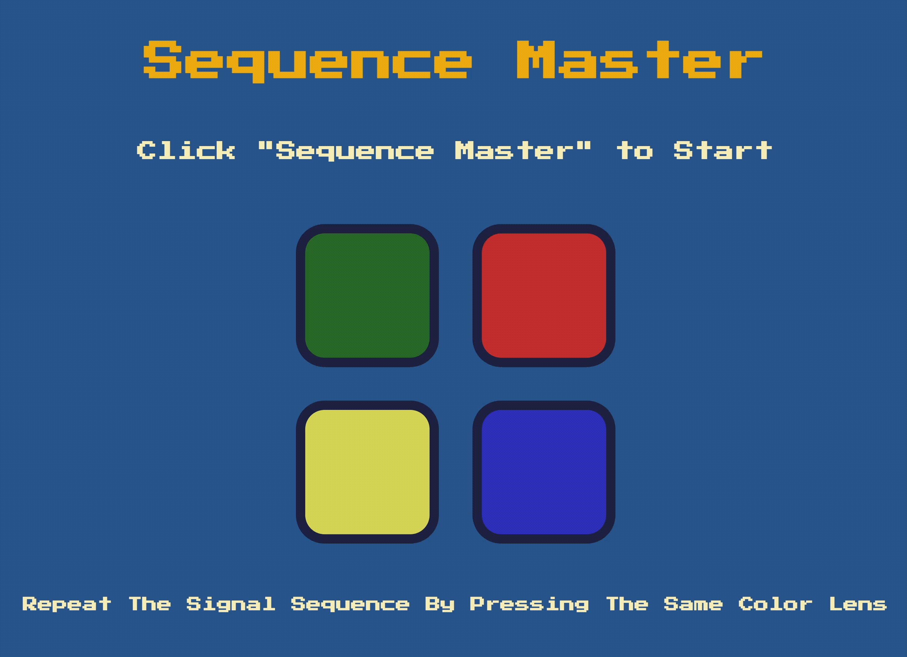

# Sequence Master Game

## Description

Sequence Master is a browser-based interactive memory game created with jQuery, in which players are challenged to memorize and replicate a sequence of flashing colors. Each successful attempt leads to an incrementally longer sequence, testing the player's memory and concentration as they progress through the levels.

## Preview

## Features

- **jQuery Enhanced**: The game logic and interactivity are powered by jQuery, providing a smooth user experience.
- **Progressive Difficulty**: Players advance through levels with an increasing sequence length, making each round more challenging than the last.
- **Visual & Auditory Cues**: Each color in the sequence is associated with a unique sound and flash animation for better retention and recall.
- **Interactive Animations**: Hover animations on the title and buttons enhance the interactivity, especially for touch-screen users.
- **Responsive Feedback**: The game provides instant feedback for correct and incorrect actions with sound and visual effects, including a game over alert when the player fails to replicate the sequence.
- **Responsive Design**: The game's layout is fully responsive and suitable for various device screens and resolutions.

## How to Play

1. Open the game at [https://qwerac388.github.io/sequence-master/](https://qwerac388.github.io/sequence-master/)
2. Press "Sequence Master" to initiate the first level.
3. Observe the sequence of colors highlighted by the game.
4. Click the buttons in the same order as the highlighted sequence.
5. Successfully replicate the pattern to advance to the next level, where an additional step is added to the sequence.
6. If an incorrect color is selected, the game will signal an end, and the player can restart by pressing "Sequence Master".
